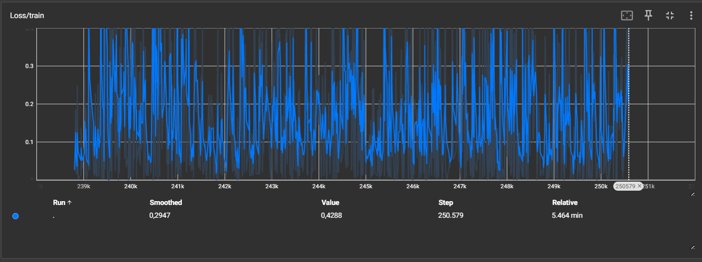
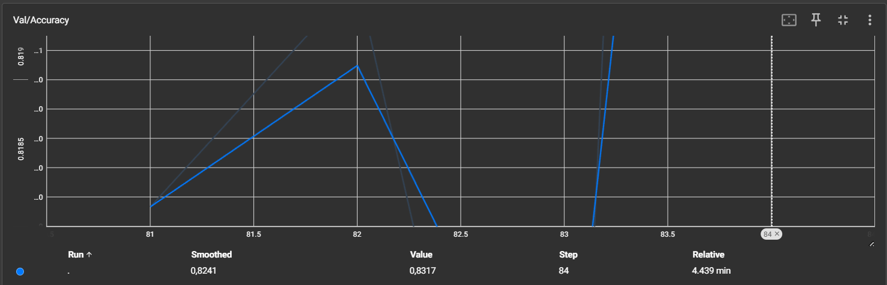
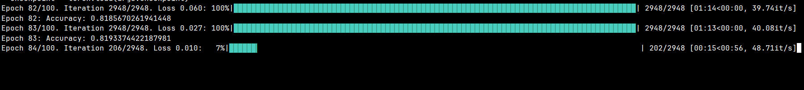
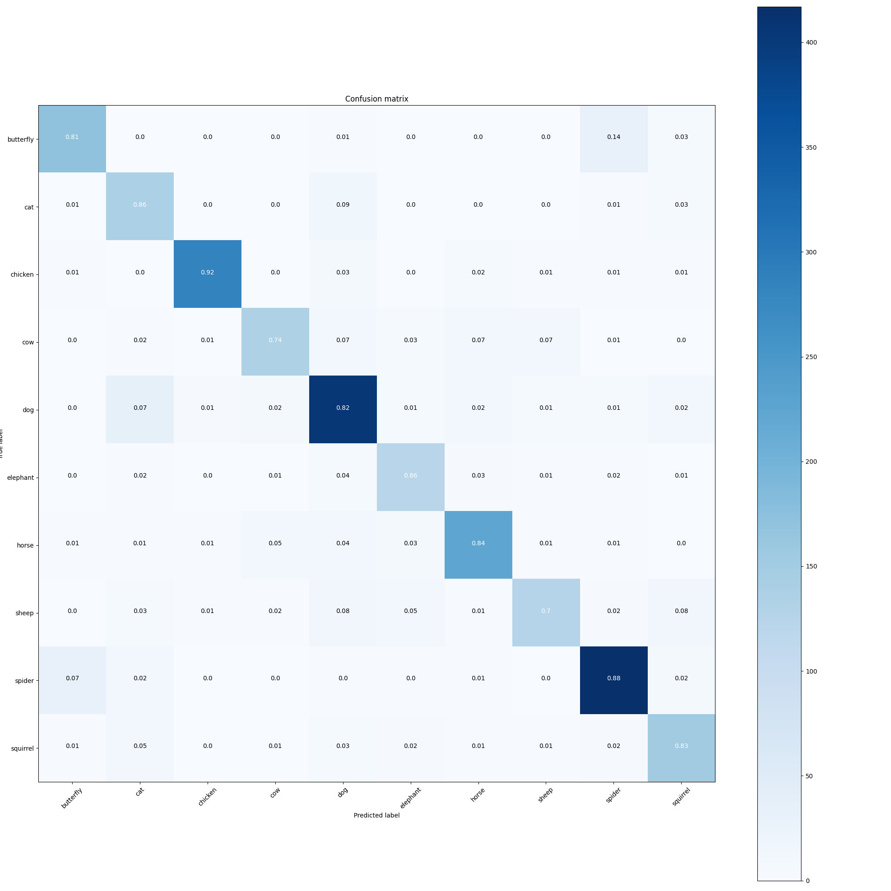
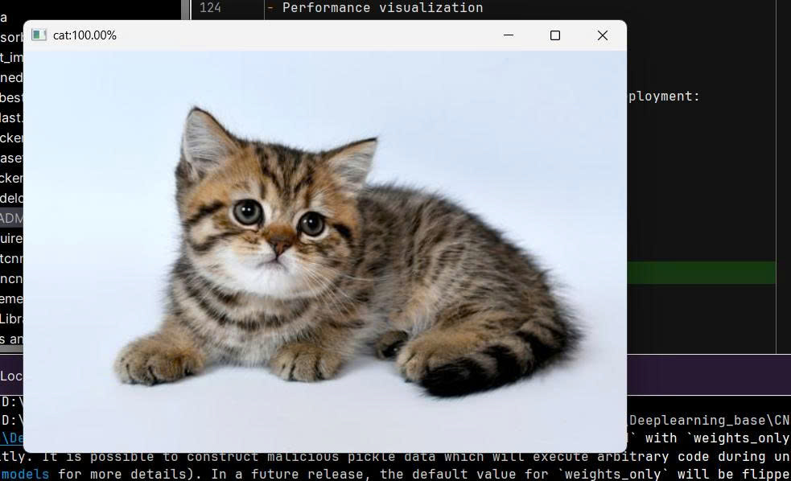
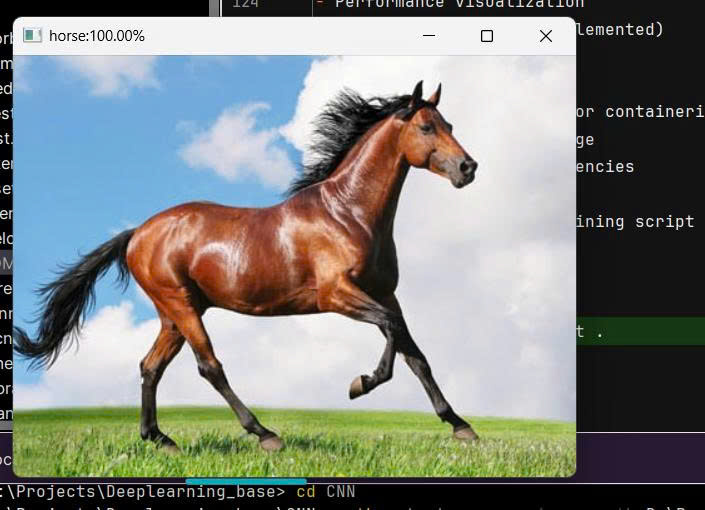
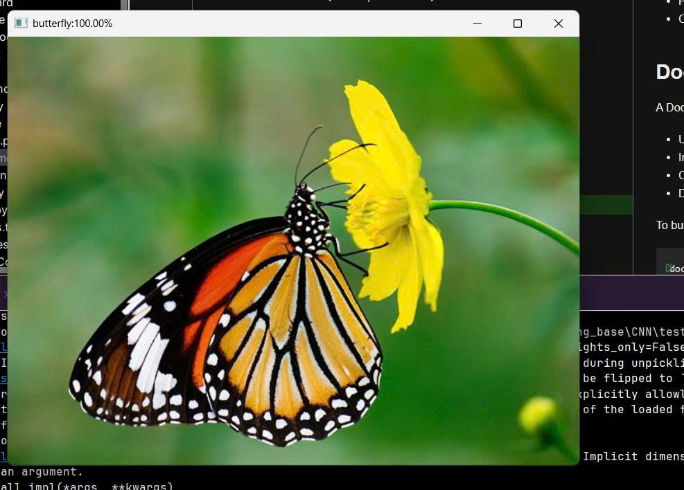
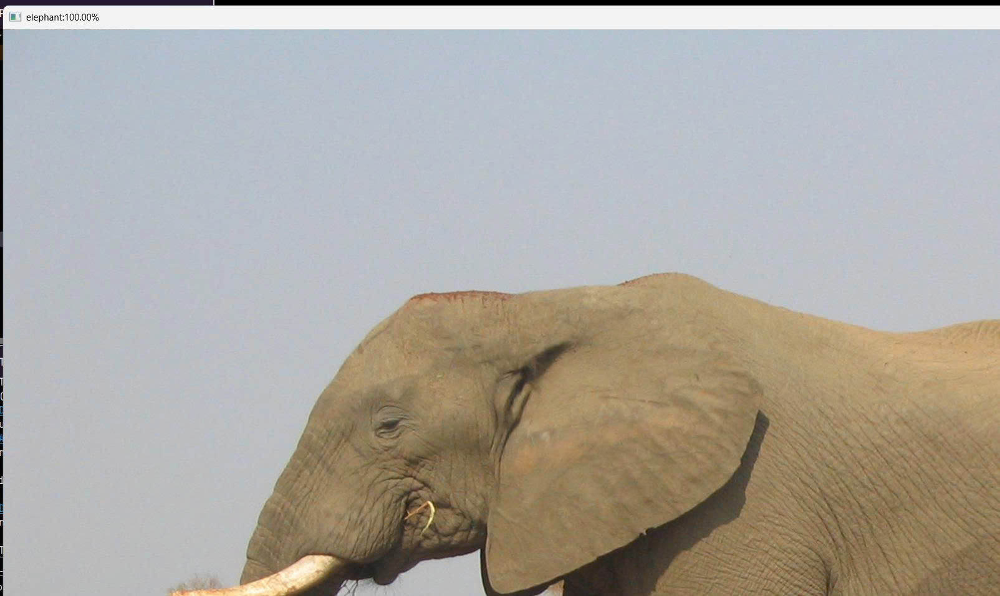

<<<<<<< HEAD
# CNN Project - Animal image classification
[](https://github.com/uvipen/CNN-Image-Classification-of-Animals/stargazers)
[](https://github.com/uvipen/CNN-Image-Classification-of-Animals/network)
[](https://github.com/uvipen/CNN-Image-Classification-of-Animals/blob/master/LICENSE)


A Convolutional Neural Network (CNN) project for image classification, built with PyTorch.

## Table of Contents
- [Overview](#overview)
- [Features](#features)
- [Project Structure](#project-structure)
- [Requirements](#requirements)
- [Installation](#installation)
- [Usage](#usage)
- [Training](#training)
- [Testing](#testing)
- [Docker Support](#docker-support)
- [TensorBoard Visualization](#tensorboard-visualization)
- [Dataset](#dataset)
- [Model Architecture](#model-architecture)
- [Results](#results)
- [Contributing](#examples)

## Overview
This project implements a Convolutional Neural Network for image classification tasks. The model is built using PyTorch and includes functionality for training, evaluation, and prediction on custom datasets.

## Features
- Custom CNN architecture
- Training and evaluation pipelines
- Model checkpointing and best model saving
- TensorBoard logging for visualization
- Docker support for easy deployment
- Pre-trained model loading and prediction

## Project Structure
```
CNN/
├── dataset.py          # Dataset and data loading utilities
├── modelcnn.py         # CNN model definition
├── traincnn.py         # Training pipeline
├── testcnn.py          # Testing and evaluation pipeline
├── Dockerfile          # Docker configuration
├── .dockerignore       # Docker ignore rules
├── requirements.txt    # Python dependencies
├── images/             # Project images and diagrams (not included in Git)
├── data/               # Data directory (not included in Git)
├── trained_models/     # Trained model checkpoints (not included in Git)
├── tensorboard/        # TensorBoard logs (not included in Git)
└── test_image/         # Test images (not included in Git)
```

## Requirements
- Python 3.7+
- PyTorch
- Torchvision
- TensorBoard
- NumPy
- Pillow

For the complete list of dependencies, please see `requirements.txt`.

## Installation

### Option 1: Native Installation
1. Clone the repository:
   ```bash
   git clone https://github.com/yourusername/cnn-project.git
   cd cnn-project
   ```

2. Create a virtual environment (recommended):
   ```bash
   python -m venv .venv
   .venv\Scripts\activate  # On Windows
   # source .venv/bin/activate  # On Linux/Mac
   ```

3. Install dependencies:
   ```bash
   pip install -r requirements.txt
   ```

### Option 2: Docker
1. Build the Docker image:
   ```bash
   docker build -t cnn-project .
   ```

2. Run the container:
   ```bash
   docker run -it cnn-project
   ```

## Usage

### Training
To train the model, run:
```bash
python traincnn.py
```

### Testing
To test the model, run:
```bash
python testcnn.py
```

### Custom Image Prediction
To make predictions on custom images, place them in the `test_image` directory and run the appropriate prediction script.

## Training
The training process includes:
- Data augmentation and preprocessing
- Model training with validation
- Checkpoint saving
- Best model preservation
- TensorBoard logging for metrics visualization

Key training parameters are configurable in `traincnn.py`:
- Number of epochs
- Batch size
- Learning rate
- Validation frequency
- Model saving frequency

## Testing
The testing process evaluates the trained model on a test dataset and provides:
- Accuracy metrics
- Loss calculation
- Performance visualization
- Confusion matrix (if implemented)

## Docker Support
A Dockerfile is provided for containerized deployment:
- Uses Python 3.9 slim image
- Installs required dependencies
- Copies project files
- Default command runs training script

To build and run:
```bash
docker build -t cnn-project .
docker run -it cnn-project
```

For TensorBoard access, run:
```bash
docker run -p 6006:6006 cnn-project
```

## TensorBoard Visualization
Training metrics and logs are saved in the `tensorboard` directory. To view them:
1. Start TensorBoard:
   ```bash
   tensorboard --logdir=tensorboard
   ```
   
    
   
2. Navigate to `http://localhost:6006` in your browser
### Training and Validation Results

**Training Loss**
- The training loss oscillated between 0.05 and 0.35 with a smoothed average of ~0.29.
- Despite fluctuations, the loss trend is generally decreasing, indicating stable learning.
- The fluctuations may result from a relatively high learning rate or small batch size.

**Validation Accuracy**
- The validation accuracy reached **83.17%**, with a smoothed value around **82.4%**.
- This shows good generalization to unseen data and no severe overfitting.

**Overall Conclusion**
- The model converged successfully with solid accuracy for a 10-class animal classification task.
- Future improvement may focus on stabilizing the training curve and further fine-tuning the CNN architecture.
## Dataset
The project is configured to work with an `animals` dataset in the `data` directory. The dataset structure should follow the standard PyTorch format:
```
data/
└── animals/
    ├── train/
    │   ├── class1/
    │   ├── class2/
    │   └── ...
    ├── val/
    └── test/
```

## Model Architecture
The CNN model (`modelcnn.py`) features:
- Multiple convolutional layers with ReLU activation
- Max pooling layers for downsampling
- Fully connected layers for classification
- Dropout for regularization
- Configurable architecture parameters

## Results
The model performance metrics will be displayed here after training completion.


## Examples
Here are some examples of the model's performance:





### Confusion Matrix Analysis

The confusion matrix shows the classification performance of the SimpleCNN model across 10 animal categories.

- Overall accuracy: ~85–90%
- Strongest classes: spider (0.98), cat (0.96), elephant (0.86)
- Weakest classes: sheep (0.70), cow (0.74)
- Most common misclassifications: 
  - cow ↔ sheep ↔ horse
  - cat ↔ dog

The predictions are close to the original image values.
class: cat

class: horse

class: butterfly

class: elephant



## Contributing
1. Fork the repository
2. Create a feature branch
3. Make your changes
4. Submit a pull request

=======
# Animal-image-classification
>>>>>>> 120b54745375e9bb669b29018d69be90166a9ee0
